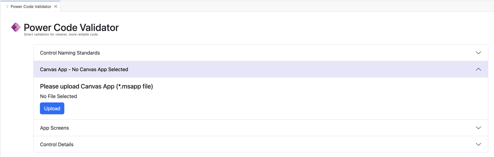
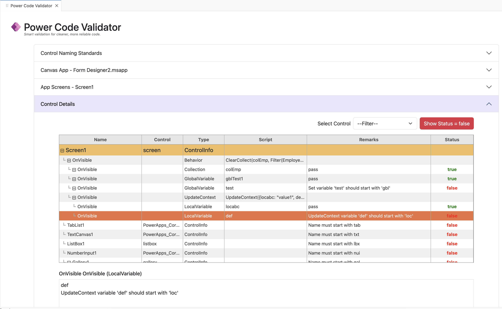

# Power Code Validator README

Power Code Validator is a Visual Studio Code extension that helps enforce naming and validation standards in **Canvas Apps**. It automatically checks your app for consistency, ensuring controls, variables, and prefixes follow project-specific rules.

## Key Features
- 🔍 Validates control prefixes against configurable project standards
- 🛠 Ensures all variables are properly declared
- ⚡ Provides quick feedback directly inside VS Code
- 📂 Customizable configuration for project-specific naming rules
- 🚀 Helps maintain consistency and best practices across large Canvas Apps
- 📊 Reduces manual code review effort by automating validations 

## Code Validation in Action

The Power Code Validator makes it easy to identify naming and coding standard issues in your Canvas Apps.  From the main screen, you can quickly review all controls, variables, and prefixes against the configured project standards.

 

The **Control Name Standards** screen allows you to configure and verify the naming prefixes used for each control type in your Canvas Apps.  By maintaining consistent prefixes, your project remains clean, standardized, and easier to maintain.
 

- **Reset**  
  Clears the current validation results and overwrites previously saved data with the default configuration included when the extension was installed.  Useful for starting fresh or discarding any custom changes.

- **Download**  
  Exports the current naming standards or validation results into a JSON file.  This makes it easy to share configurations across projects or store them in source control.

- **Upload**  
  Allows importing a JSON configuration file containing naming standards.  This helps teams apply the same validation rules consistently across multiple environments.

- **Save**  
  Persists the updated standards or validation configurations within the tool.  Ensures that changes are retained and applied during future validations.

 

The Canvas App Selection screen provides a list of available apps from the environment. Choose the app to run validation against, ensuring that code and naming standards are applied to the correct project.

 

View list of all the screens contained within the selected Canvas App.  This provides a clear overview of the app structure, helping users navigate through screens and apply validations at the correct level.

 

The Control Details displays all controls and their associated formulas within the selected screen.  This allows users to validate control naming conventions and verify code consistency according to project standards.

- **Show Status = False**

    This action filters the table to display only child rows where the `status` field is set to `false`.  It helps quickly identify controls or variables that do not meet the project standards, making inconsistencies easy to spot and correct.

    - Applies the filter only to **child rows**; parent rows remain visible to preserve the app hierarchy.  
    - Clicking the button again **clears the filter**, restoring the full view.  
    - The button changes appearance to indicate when the filter is active, providing visual feedback to the user.

 

## Runtime Dependency

This extension uses the following runtime dependency:

- **[unzipper](https://www.npmjs.com/package/unzipper)** – used to extract and process `.zip` files, which is required when unpacking Canvas App source files for validation.

## Extension Settings

This extension contributes the following settings:

* `powercodevalidator.enable`: Enable/disable the Code Validator extension (default: `true`).

## Known Issues

- ❌ Does not validate or detect errors in **Power Fx** formulas
- 🔄 Changes based on project standards must be manually applied in the Canvas App; no automation is provided
- ⚠️ Limited to naming and validation checks; does not cover performance or accessibility issues

## Release Notes

## 1.0.0

Initial release.

**Enjoy!**
